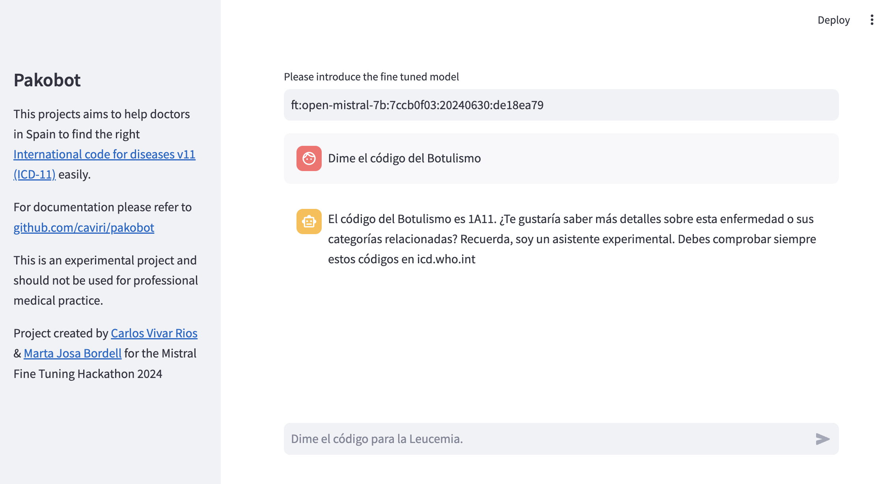

# Pakobot

[](https://pakobot.streamlit.app)

<iframe width="560" height="315" src="https://www.youtube.com/embed/oMNpTxRnvIw?si=IsTJh9onn2XjN1HB" title="YouTube video player" frameborder="0" allow="accelerometer; autoplay; clipboard-write; encrypted-media; gyroscope; picture-in-picture; web-share" referrerpolicy="strict-origin-when-cross-origin" allowfullscreen></iframe>

Project presented in Mistral Fine Tuning Hackathon 2024. 



Pakobot is an assistant that allows Spanish clinicians to obtain and refine an International Code for Diseases based in a decided diagnosis. Currently the official apps only allow string-based search. Using a chatbot interface, clinicians can nail down the desired code.

Pakobot doesn't provide the diagnosis; it just helps to find the correct code. Also, this is a highly experimental project. Do not use in profesional environments and confirm always the code in ICD page.

### Team members for the Hackathon

- [Marta Josa Bordel](http://ovellaverda.cat): Synthetic data generation and communications.
- [Carlos Vivar Rios](http://www.carlosvivarrios.com): Concept, sythetic data generation, and fine-tuning.

## Privacy and sensitive data.

Pakobot doesn't require any personal information from the patients. It just require the diagnosis terms that the clinician has identified. Therefore, no sensitive data is transmitted to the bot.

## Why not a RAG?

In simple terms, we want to check how far can we go just with fine tuning in terms of hallucinations. Also, the ultimate goal of pakobot is to be compiled into ONNX and be able to run serveless in the browser using `transfromers.js`.

However, in this project we would like to explore the use of a RAG and perform automatic evaluation of the answers provided. 

## How to run this model?

You can go to [pakobot.streamlit.app](pakobot.streamlit.app) and try the `ft:open-mistral-7b:7ccb0f03:20240630:257f6a77` model if you have a Mistral API Key. **Take in account that the project is not properly evaluated and most answer are wrong**.

## How to run this project in local?

We recommend to use Docker. You can build the image with:

```bash
docker build -t pakobot .
```
Fill the `.env.dist` with the right keys. And then run the gui with:

```bash
docker run -it  -p 8501:8501 --env-file .env -t pakobot
```

This should make the tool availble in [http://localhost:8501](http://localhost:8501)

## How it was made?

### Data extraction

We used te ICD official API in order to retrieve the linearized terms. We obtained a dataframe per main category containing the following fields: 

- `id`
- `api-url`
- `browser-url`
- `title`
- `synonyms`
- `icd-code`
- `description`
- `parents`
- `parents-title`
- `parents-code`
- `childrens`
- `childrens-title`
- `childrens-code`

Sample for the data is provided in `./data/cie11` for the category [1435254666](https://icd.who.int/browse/2024-01/mms/es#1435254666): "01 Algunas enfermedades infecciosas o parasitarias".

ICD-11 is licensed under the Creative Commons Attribution-NoDerivs 3.0 IGO license (CC BY-ND 3.0 IGO).

### Synthetic data generation

In order to generate the training data we performed two rounds of data synthesis using [Nemotron 4 340B Instruct Model by Nvidia](https://build.nvidia.com/nvidia/nemotron-4-340b-instruct). The first round provided 20 questions per row or item in the ICD ontology. Then, a second round took each question and asked the model to provide a feasible answer based in the ground truth context. The result was stored in a `jsonl` file and named as `{ICD-ID}_{DF_Index}.jsonl`.

Nemotron-3 license allows the reuse of the output for training third-party models. 

A sample of the data can be found in `./data`, while the scripts to generate the synthetica data are located in `./synthetic_data`.

### Fine tuning

After generating the synthetic data, we proceded to fine-tune the model using the [MISTRAL API](https://docs.mistral.ai/guides/finetuning/) with the following parameters:

```
created_job = client.jobs.create(
    model="open-mistral-7b",
    training_files=[training_data.id],
    hyperparameters=TrainingParameters(
        training_steps=100,
        learning_rate=0.0001,
        )
)
```

The code for this can be found in `./fine-tuning`. 

### Streamlit App

In order to demo the app we provide a chat interface using the library [streamlit python library](https://streamlit.io/).

### Evaluation 

The evaluation was performed with a doctor but it requires further validation. One method we are exploring is to test the results against a RAG system where the ICD-DB has been stored. 

## Development

This is a project under heavy development. Check out the roadmap and feel free to open an issue if you would like to contribute.

### Roadmap

- Increase the number of conversations.
- Improve the prompts. 
- English and French versions.
- Provide compatibility with ICD-9 and ICD-10 (Still in use in some areas such as Andalusia, Spain).
- Make use of `nemotron-4-340b-reward` to filter out the best conversations.
- Implement an evaluation of the model performance based in RAG. 
- Compile the model in ONNX and attempt its usage in the browser via `transformers.js`

